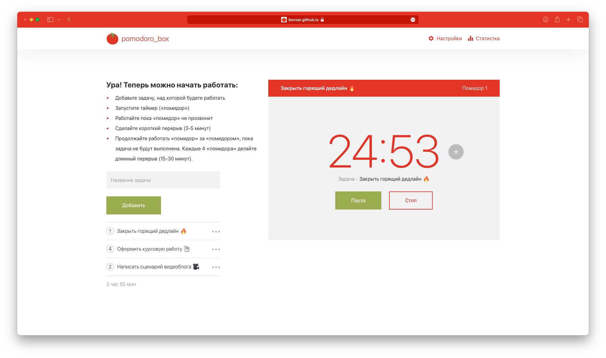
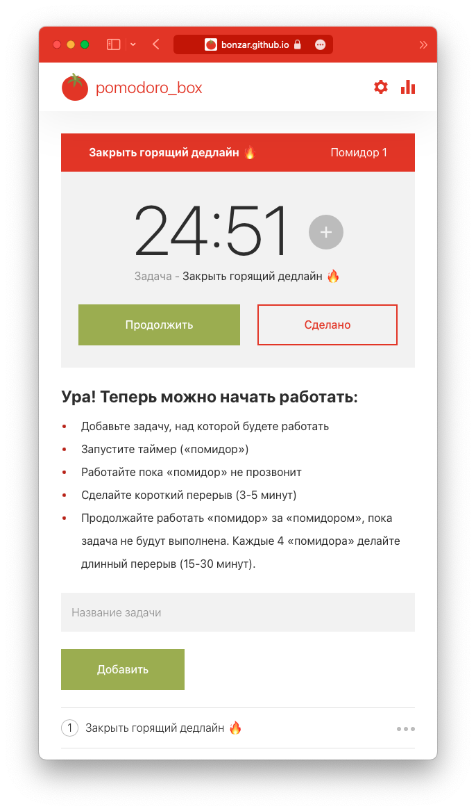
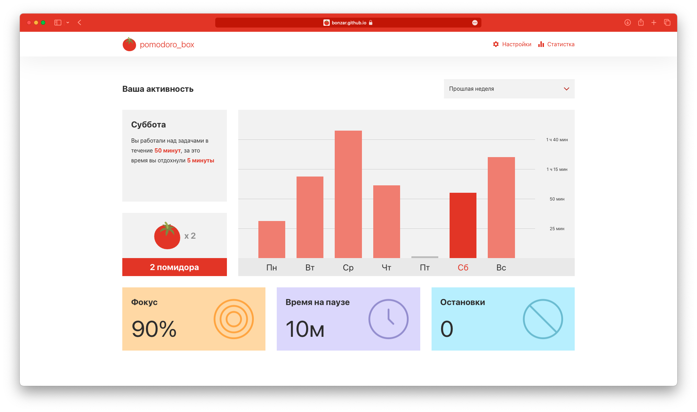
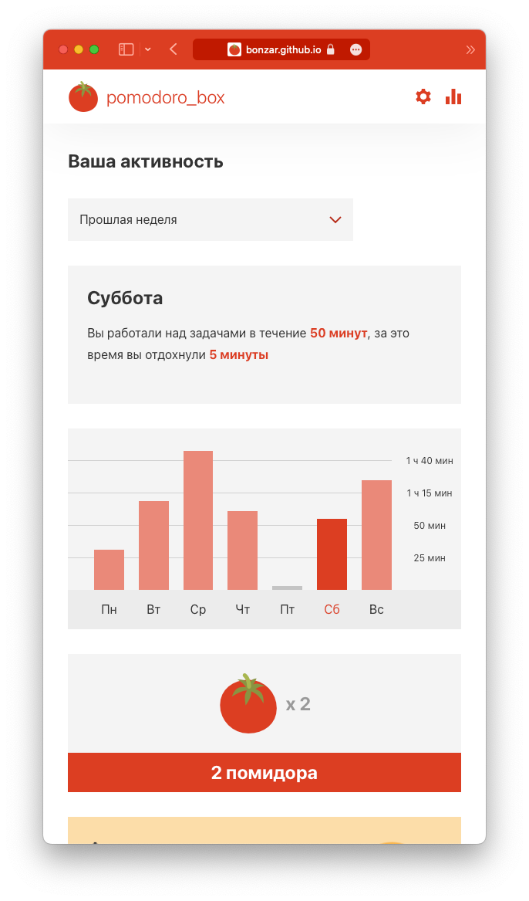

# Pomodoro_box: React JS Pomodoro Timer

Pomodoro_box is a web application built with React JS that helps improve productivity and focus using the Pomodoro Technique. The application features a sleek and intuitive user interface with various functionalities to enhance your work or study sessions.

## Stack

- **TypeScript**
- **React JS**
- **Redux Toolkit**
- **Redux Persist**
- **React Router**
- **Vite**
- **ESLint**
- **Prettier**

## Features

- **Pomodoro Timer**: Set timers for focused work sessions (pomodoros), short breaks, and long breaks to optimize productivity. Alternate between short breaks and long breaks after completing a certain number of pomodoros.
- **Task Management**: Add and manage tasks within the application, including setting the number of planned pomodoros for each task.
- **Dark Theme**: The application's theme automatically syncs with the system's dark mode preference, providing a seamless experience in both light and dark environments.
- **Adaptive Design**: Enjoy a responsive and adaptive user interface that adjusts seamlessly across different devices and screen sizes.
- **Settings**: Customize timer and break durations, define long break intervals, and adjust week start day.
- **Statistics**: View weekly summaries and specific details for each day, including completed pomodoros, work time, break time, pause time, and timer stops.
- **Notifications**: Receive sound notifications when timers complete to help you stay on track.
- **Progressive Web App (PWA)**: Install the Pomodoro_box app on your device, allowing you to use it like a native application and access it offline.
- **Persistent State**: The application saves its state in the browser's local storage, allowing you to resume where you left off.

## Try it Out

Explore the Pomodoro_box application by accessing the live version: [Try it Out](https://bonzar.github.io/pomodoro_box/)

## Screenshots




## Getting Started

To run the Pomodoro_box application on your local machine, follow these steps:

1. Clone the repository:

   ```shell
   git clone https://github.com/Bonzar/pomodoro_box.git
   ```

2. Install the dependencies:

   ```shell
   cd pomodoro_box
   yarn install
   ```

3. Start the development server:

   ```shell
   yarn dev
   ```

4. Access the application in your browser at `http://127.0.0.1:5173/pomodoro_box`.

## Contributing

Contributions are welcome! If you'd like to contribute to Pomodoro_box, please follow these guidelines:

1. Fork the repository from the `development` branch.
2. Create a new branch from the `development` branch to work on your feature or bug fix.
3. Make your changes, commit them, and push the branch to your forked repository.
4. Open a pull request (PR) from your branch to the `development` branch in the main repository.
5. Provide a clear description of your changes and any relevant information in the PR.
6. Once your PR is reviewed and approved, it will be merged into the `development` branch.

Thank you for considering contributing to this project!

## License

Pomodoro_box is licensed under the [MIT License](https://opensource.org/licenses/MIT). You are free to use, modify, and distribute this software for personal or commercial purposes. See the LICENSE file for more details.
